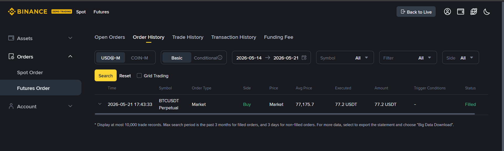
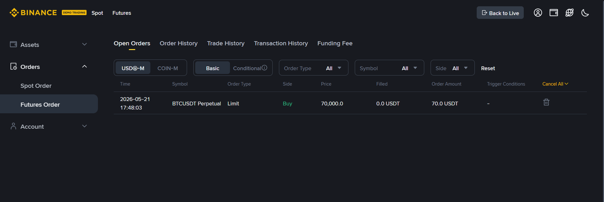

# trading_bot

Small Python app to place orders on Binance Futures Testnet (USDT-M).

## Setup

1. Create a virtual environment and install dependencies:

```bash
python -m venv .venv
.\.venv\Scripts\activate
pip install -r requirements.txt
```

2. Set environment variables (or create a `.env` file in the project root):

```bash
BINANCE_API_KEY=your_testnet_api_key
BINANCE_API_SECRET=your_testnet_api_secret
# optional: BINANCE_FUTURES_BASE_URL=https://testnet.binancefuture.com
```

> Note: These must be Binance Futures USDT-M testnet credentials. Regular Binance or spot-testnet API keys will not work for the futures testnet endpoint.

> If you see `Invalid API-key, IP, or permissions for action`, verify the key was created for Binance Futures Testnet and has trading permissions.

## Usage

Interactive mode:

```bash
python cli.py
```

This will prompt you for symbol, side, order type, quantity, and price when required.

Command mode:

```bash
python cli.py order --symbol BTCUSDT --side BUY --type MARKET --quantity 0.001
python cli.py order --symbol BTCUSDT --side SELL --type LIMIT --quantity 0.001 --price 30000
```

## Notes

- A log file named `trading_bot.log` is created in the project root.
- The CLI prints the endpoint in use and reports order summary details.

## Logs

- `log_file.txt`: a plain-text record of two sample orders placed on the Binance Futures Testnet during a manual run. It contains timestamped request and response log lines.

## Screenshots

Here are the actual screenshots captured during the testnet order runs:





## Adding screenshots to this repository

1. Add image files to the existing `screenshots/` directory at the repository root.

2. Commit and push the images:

```bash
git add screenshots/your-file.png
git commit -m "Add screenshot: your-file"
git push origin main
```

3. Reference images in `README.md` using Markdown:

```markdown

```

Alternatively, on GitHub you can drag-and-drop images into the issue/PR/editor to upload and embed them automatically.

## Files

- `bot/client.py`: Binance Futures Testnet API wrapper
- `bot/orders.py`: order placement and reporting logic
- `bot/validators.py`: input validation helpers
- `bot/logging_config.py`: structured file logging
- `cli.py`: command line entrypoint using Typer
